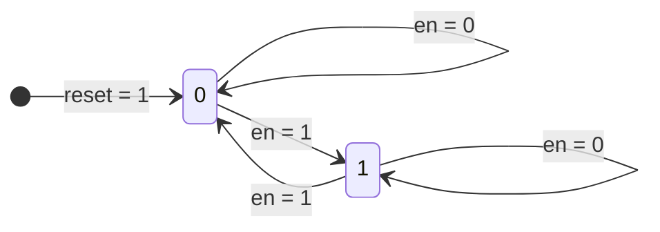
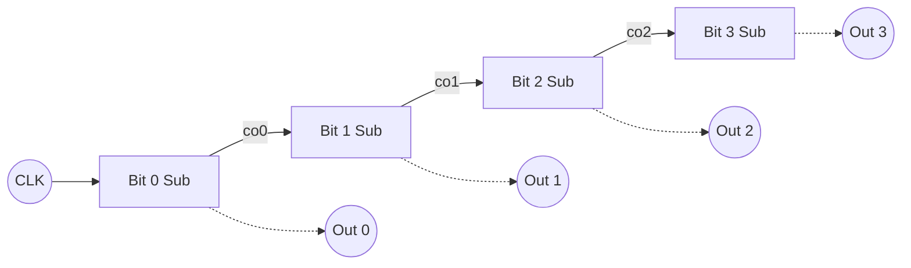

# Counter

## Summary

카운터는 순차논리회로에 속하며, 숫자를 세고 저장하기 위해 레지스터를 사용한다.

이 프로젝트에서 구현할 것은 클럭의 rising edge 시에 출력 `q` 가 증가하고 비동기 입력 `reset` 이 있는 단순한 형태의 동기식 카운터 회로이다.

전가산기와 마찬가지로 하위 모듈을 인스턴스화 하여 상위 모듈에서 직렬로 연결하는 방식이 있고, `+` 연산자를 활용하여 추상적으로 구현하는 방식이 있다.

## Design 1

하위 모듈을 인스턴스화 하여 상위 모듈에서 직렬로 연결한 4bit 카운터 회로 설계이다.

[counter_instance.sv](/rtl/counter/counter_instance.sv)

### Top-Level architecture


### RTL Synthesis Schematic


### State Diagram



위 상태도는 1bit 하위 모듈 카운터의 상태를 나타낸 것이다. `en` 신호가 `1` 일 때 2개의 상태를 오가는 **`토글(Toggle)`** 형태가 된다.

<br>



하위 모듈 4개를 직렬 연결하여 4bit 카운터를 나타낸 다이어그램이다.

<br>

### 1 bit counter (하위 모듈)

``` SystemVerilog
module cnt_unit(clk, reset, en, q, co);
    input clk, reset, en;
    output logic q, co;

    always @ (posedge clk or posedge reset) begin
        if (reset == 1'b1)
            q <= 1'b0;
        
        else if (en == 1'b1)
            q <= ~q;
    end

    assign co = en & q;

endmodule
```

1 bit binary 카운터 하위 모듈을 구현한 순차논리회로로, `posedge` 로 rising edge 시에 동작하도록 설계했다. 

### 4 bit ripple counter (상위 모듈)

``` SystemVerilog
module counter_cell(clk, reset, q);
    input clk, reset;
    output logic [3:0] q;
    logic [3:0] co;

    cnt_unit cu0(.clk(clk), .reset(reset), .en(1'b1), .q(q[0]), .co(co[0]));
    cnt_unit cu1(.clk(clk), .reset(reset), .en(co[0]), .q(q[1]), .co(co[1]));
    cnt_unit cu2(.clk(clk), .reset(reset), .en(co[1]), .q(q[2]), .co(co[2]));
    cnt_unit cu3(.clk(clk), .reset(reset), .en(co[2]), .q(q[3]), .co(co[3]));

endmodule
```

`cnt_unit` 하위 모듈 4개를 직렬연결한 4bit ripple counter 로, 전체적으로 모듈 외부에서의 입력은 `clk` 와 `reset` 두 가지, 출력은 4bit `q` 뿐이다.

## Design 2

**Design 1** 은 하위 모듈 내부에서 현재 출력 상태와 이전 모듈의 carry out 을 연산하는 기능을 구체화한 것이다. 목표는 뒷단 모듈로 carry 를 넘겨줘 그것을 현재 상태와 더하는 것인데, 이런 가산 기능은 추상화된 연산자 `+` 로 사용이 가능하다.

[counter_adder.sv](/rtl/counter/counter_adder.sv)

``` Verilog
    always @ (posedge clk or posedge reset) begin
        // Asynchronous input
        if (reset == 1'b1)
            // 4'h0 : 4bit 0x0 = 0000(2)
            q <= 4'h0;
        
        else
            // 4'h1 : 4bit 0x1 = 0001(2)
            q <= q + 4'h1;
    end
```

코드의 핵심은 `else` 문에서 `q` 의 현재 상태와 4bit 1 을 더한 것을 할당하는 것이다. `q` 는 4bit 이기 때문에 `4'h1` 을 더한다. 또는 2진수로 가중치를 고려한다면 `4'h1` 대신 `4'b0001` 이라고 쓰는 것도 가능하다.

## Syntax Note

### always statement

`always` 문은 그 이후에 오는 `@ (sensitivity list)` 의 조건에 따라 그 이후에 오는 문(statement)을 실행한다.

HDL 이 여타 프로그래밍 언어와 가장 다른 점은 병렬적으로 처리할 수 있다는 것이다. 이후에 오는 신호가 순차논리회로라면 `<= (non-blocking assignment)` 로 신호를 할당하며, 병렬적으로 처리한다. 이후에 오는 신호가 CL이면 `= (blocking assignment)` 로 신호를 할당하며, 순자척으로 처리한다.

특히 CL 신호 할당을 위해 `always` 문을 사용할 때는 `always @ (*)` 으로 쓰며, `sensitivity list` 가 특정되지 않아 그 이후에 오는 모든 신호의 변화에 반응하여 실행된다. system verilog 에서는 유지보수의 편의성을 위해 `always_comb` 라고 표기한다.

### type

Verilog 에는 주로 2가지 형(type)이 있으며, `reg` 와 `net` 형이 있다. `net` 형은 `wire`, `tri` 등이 포함되어 있으며 레지스터를 생성하지 않고 합성시 물리적인 도선을 만든다.

`reg` 형은 정보를 저장하는 능력이 있고, 기본적으로 `always` 문의 할당 대상 신호는 순차논리회로이든 CL이든 문법적으로 모두 `reg` 형이어야만 한다. 이런 특성 때문에 실제로 합성시 `reg` 형으로 선언한 변수가 물리적인 레지스터를 생성하지 않고 CL로 구성될 수 있다. 가령 `always` 문 내 `if-else` 문으로 MUX 기능을 구현한다면 실제 합성시 CL로 구성된다.

System Verilog 에서는 이러한 혼란을 방지하기 위해 `wire` 와 `reg` 형을 통합한 `logic` 형을 사용하며, `net` 형은 다중 드라이버를 위해 사용한다(`tri` 등).
