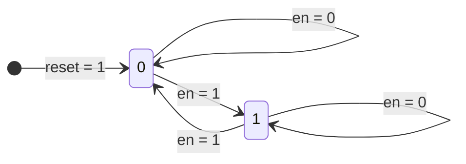
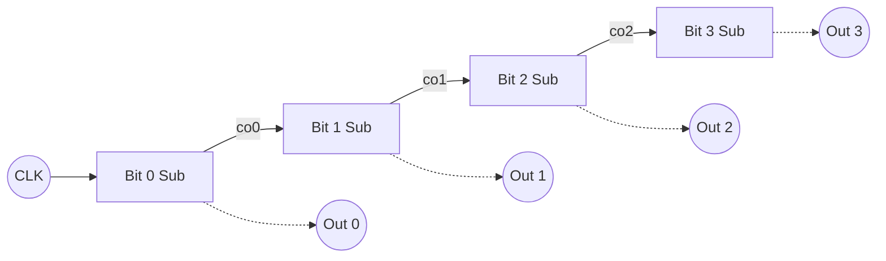

# Counter

## Summary

카운터는 순차논리회로에 속하며, 숫자를 세고 저장하기 위해 레지스터를 사용한다.

이 프로젝트에서 구현할 것은 클럭의 rising edge 시에 출력 `q` 가 증가하고 비동기 입력 `reset` 이 있는 단순한 형태의 동기식 카운터 회로이다.

전가산기와 마찬가지로 하위 모듈을 인스턴스화 하여 상위 모듈에서 직렬로 연결하는 방식이 있고, `+` 연산자를 활용하여 추상적으로 구현하는 방식이 있다.

## Design 1

하위 모듈을 인스턴스화 하여 상위 모듈에서 직렬로 연결한 4bit 카운터 회로 설계이다.

[counter(instance).v](/rtl/counter/counter(instance).v)



위 상태도는 1bit 하위 모듈 카운터의 상태를 나타낸 것이다. `en` 신호가 `1` 일 때 2개의 상태를 오가는 **`토글(Toggle)`** 형태가 된다.

<br>



하위 모듈 4개를 직렬 연결하여 4bit 카운터를 나타낸 다이어그램이다.

<br>

### 1 bit counter (하위 모듈)

``` Verilog
module cnt_unit(clk, reset, en, q, co);
    input clk, reset, en;
    output q, co;
    reg q;

    always @ (posedge clk or posedge reset) begin
        if (reset == 1'b1)
            q <= 1'b0;
        
        else if (en == 1'b1)
            q <= ~q;
    end

    assign co = en & q;

endmodule
```

1 bit 카운터 하위 모듈을 구현한 순차논리회로로, `posedge` 로 rising edge 시에 동작하도록 설계했다. 

### 4 bit ripple counter (상위 모듈)

``` Verilog
module counter_cell(clk, reset, q);
    input clk, reset;
    output [3:0] q;
    wire [3:0] co;

    cnt_unit cu0(.clk(clk), .reset(reset), .en(1'b1), .q(q[0]), .co(co[0]));
    cnt_unit cu1(.clk(clk), .reset(reset), .en(co[0]), .q(q[1]), .co(co[1]));
    cnt_unit cu2(.clk(clk), .reset(reset), .en(co[1]), .q(q[2]), .co(co[2]));
    cnt_unit cu3(.clk(clk), .reset(reset), .en(co[2]), .q(q[3]), .co(co[3]));

endmodule
```

`cnt_unit` 하위 모듈 4개를 직렬연결한 4bit ripple counter 로, 전체적으로 모듈 외부에서의 입력은 `clk` 와 `reset` 두 가지, 출력은 4bit `q` 뿐이다.

## Design 2

**Design 1** 은 하위 모듈 내부에서 현재 출력 상태와 carry out 을 연산하는 기능을 구체화한 것이다. 목표는 뒷단 모듈로 carry 를 넘겨줘 그것을 현재 상태와 더하는 것인데, 이런 가산 기능은 추상화된 연산자 `+` 로 사용이 가능하다.


